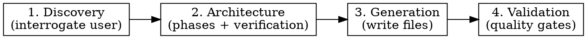
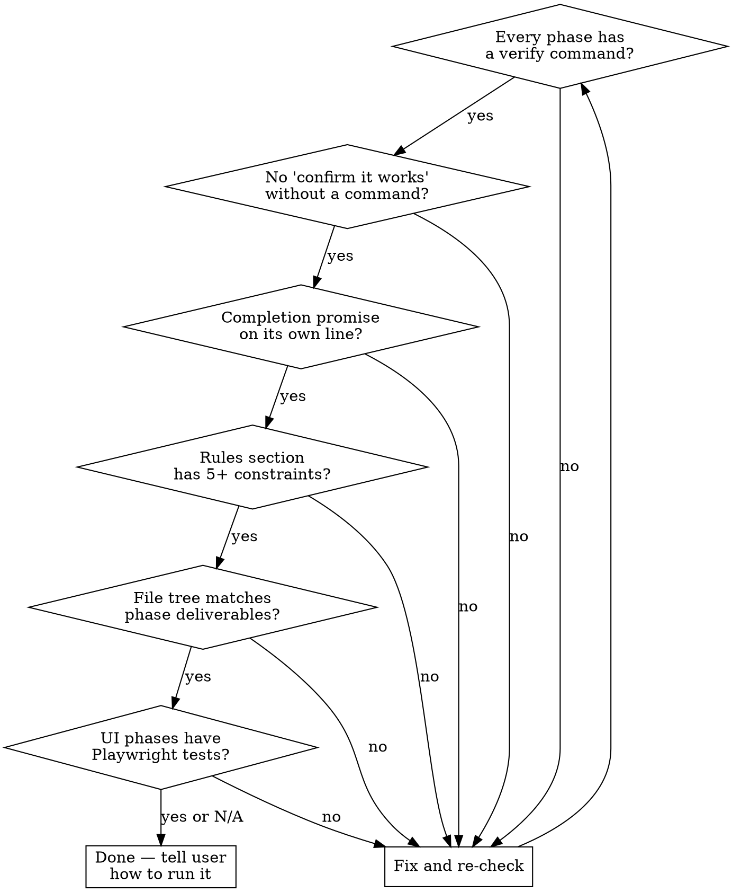

# The Ralphinator

Build production-ready Ralph Wiggum loop prompts through guided discovery. Output is a complete package ready for `/ralph-loop`.

## Process Overview



Work through all 4 stages sequentially. Do not skip ahead.

## Stage 1: Discovery

Use AskUserQuestion to gather project details. **One question at a time.** Prefer multiple-choice when possible.

### Required Information

Gather ALL of the following before proceeding to Stage 2:

**1. Project identity**
- Name (kebab-case)
- One-line description
- Directory path on disk (existing or new)

**2. Tech stack**
- Languages and versions
- Frameworks / libraries
- Runtime (Node, Bun, Deno, Python, Rust, etc.)

**3. Constraints** (critical for the Rules section)
- Banned dependencies or patterns
- File count / line count limits
- Style requirements (no comments, no TypeScript, etc.)
- Must match existing conventions? If so, read the project's CLAUDE.md

**4. Deliverables**
- List every file or component that must exist when done
- Group by type: server, frontend, library, config, tests

**5. Verification strategy** — ask which apply:

| Component Type | Default Verification |
|---------------|---------------------|
| API / server | curl + JSON response assertions |
| Frontend / UI | Playwright headless DOM assertions |
| Library / CLI | Unit tests (node --test, pytest, cargo test) |
| Infrastructure | Health checks, config validation |
| Data pipeline | Input/output assertions |

If the project has ANY frontend/UI component, Playwright tests are mandatory. See `references/verification-patterns.md` for details.

**6. Scope estimate**

| Files to create | Recommended phases | Max iterations |
|----------------|-------------------|----------------|
| 1-3 | 3-5 | 15-20 |
| 4-10 | 6-9 | 25-35 |
| 10+ | 9-12 | 35-50 |

**7. Completion criteria**
- What single objective command proves it's done?
- Default: test suite passing with zero failures
- The completion promise will be `<PROJECT_NAME_UPPER>_COMPLETE`

### Discovery Anti-Patterns

- Do NOT assume stack choices — ask
- Do NOT assume the user wants tests in a specific framework — ask
- Do NOT proceed with vague deliverables — pin down the file list
- If the user says "you decide" for constraints, apply the defaults from `references/default-rules.md`

## Stage 2: Architecture

Based on discovery answers, design the implementation plan. Present to user for approval before generating.

### Phase Design Rules

1. **Dependency order** — Phase 1 is always foundational (data model, server, core logic). Later phases build on earlier ones.
2. **1-3 files per phase** — never more. If a phase has 4+ deliverables, split it.
3. **Every phase ends with verification** — a command that returns pass/fail. No "confirm it looks right."
4. **Test infrastructure goes in the phase AFTER the first testable component** — not at the end.
5. **Integration / E2E testing is always the penultimate phase.**
6. **Final phase is always a mock/smoke test that exercises the full system.**

### Phase Template

```
#### Phase N: <title>
- [ ] Create `path/to/file.ext`
  - Bullet points describing exactly what this file contains
  - Be specific: endpoints, functions, components, behaviors
- [ ] <Additional deliverables>
- [ ] Add tests to `test/file.test.js` (if applicable):
  - Test: "<name>" — <assertion description>
  - Test: "<name>" — <assertion description>
- [ ] **Verify:** <exact command> — <expected outcome>
```

### Present Architecture to User

Before proceeding to generation, show:
1. The complete file tree
2. The phase breakdown with titles
3. The verification strategy per phase
4. The iteration cap

Ask: "Does this phase plan look right, or should I adjust anything?"

## Stage 3: Generation

Write three files to the project directory.

### File 1: Design Document

**Path:** `docs/plans/YYYY-MM-DD-<name>-design.md`

Structure:
```markdown
# <Name> — Design Document

> **Date:** YYYY-MM-DD
> **Status:** Draft

## Purpose
One paragraph.

## Architecture
ASCII diagram showing components and data flow.

## Data Model (if applicable)
Schema, types, or structures.

## Component Specifications
One section per major deliverable.

## Constraints
Copied from discovery.

## Open Questions
Anything unresolved.
```

### File 2: Ralph Prompt

**Path:** `docs/plans/YYYY-MM-DD-<name>-ralph-prompt.md`

**CRITICAL:** Follow the template in `references/prompt-template.md` exactly. The structure has been tested across many Ralph loop sessions.

Key sections:
1. **Usage block** — copy-pasteable `/ralph-loop` invocation
2. **Context** — "You are building X. Read the design doc at Y before starting."
3. **Sub-agent directive** — "Always use Opus 4.6 for all sub-agents."
4. **Project structure** — full file tree
5. **Implementation phases** — from Stage 2, with checkboxes
6. **Rules** — minimum 5 constraints, all phrased as "Do NOT"
7. **Completion** — gate condition + promise string on its own line

### File 3: CLAUDE.md (if project doesn't have one)

**Path:** `<project-root>/CLAUDE.md`

Minimal project context: name, stack, architecture summary, conventions. Under 30 lines.

### After Generation

Commit all files with: `docs: add design doc and Ralph prompt for <name>`

## Stage 4: Validation

Before declaring done, verify ALL of the following:



Read back the generated Ralph prompt and check each gate. Fix any failures before telling the user it's ready.

### Final Output to User

```
Ralph prompt ready at: <path>

To run:
  cd <project-dir>
  /ralph-loop

Task: paste the Prompt section, or tell Claude to read the file
Completion promise: <PROMISE>
Max iterations: <N>
```
